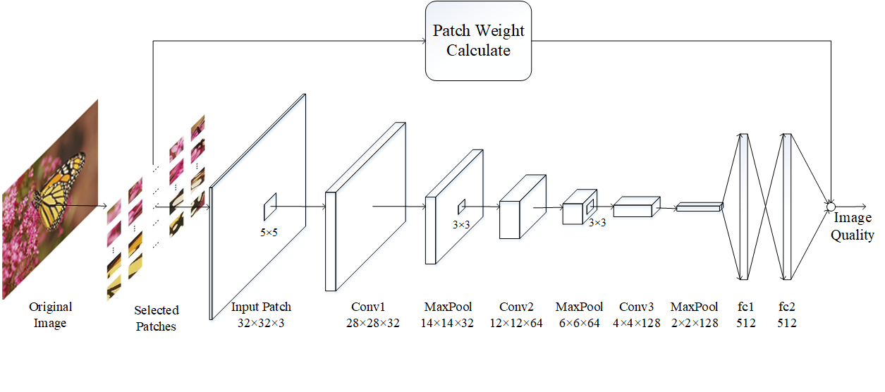
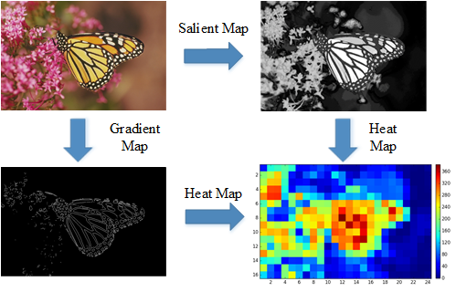
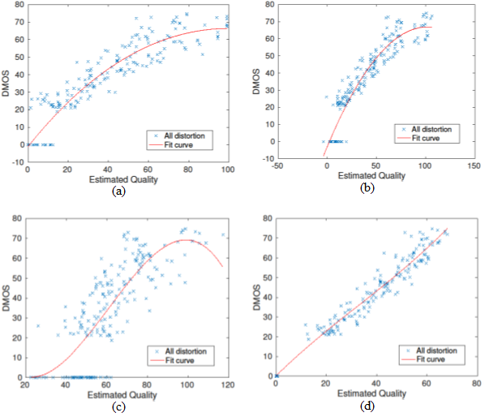

## VSBIQA
Visual Saliency Based Blind Image Quality Assessnent via Deep Convolutional Neural Network.

This is the implementation of [Visual Saliency Based Blind Image Quality Assessment via Convolutional Neural Network](https://link.springer.com/chapter/10.1007/978-3-319-70136-3_58).
 **VSBIQA** is partly based on the [deepIQA](https://github.com/dmaniry/deepIQA). This work aims to evaluate the given image's quality through deep learning method. The main difference of this work between others' works is that we proposed to use salient image patches to train a designed DL-model, thus making the feature extraction more accuracy and efficient.
 
### Architecture  
<div align="center">
	
</div>

### Heatmap  
<div align="center">
	
</div>

### Result  
<div align="center">
	
</div>

<div align="center">
	(a): BLIINDS-II; (b)BRISQUE; (c)CORNIA; (d)Ours 
</div>

### Usage  
- data preparation
In this work, we use **HC** method to calculate salient images. You can find the source code in [MingMingCheng's homepage](http://mmcheng.net/zh/SalObj/).
We use [LIVE2](http://live.ece.utexas.edu/research/quality/subjective.htm) and [CSIQ](http://vision.eng.shizuoka.ac.jp/mod/page/view.php?id=23) database for training and testing. The file directory should be:
	
```python
	VSBIQA/
	VSBIQA/data/Imageset/live2/					# live2 dataset
	VSBIQA/data/Imageset/prewitt_images/		# gradient images of live2
	VSBIQA/data/Imageset/saliency_images/		# salient images
```

- train

```shell
	python train.py --gpu 0
```

- test

```shell
	python demo.py --model ./models/nr_jay_live2.model --gpu 0
```	

### Citation  
If you find **VSBIQA** helpful in your research, please consider citing: 

	@inproceedings{li2017visual,
  		title={Visual Saliency Based Blind Image Quality Assessment via Convolutional Neural Network},
  		author={Li, Jie and Zhou, Yue},
  		booktitle={International Conference on Neural Information Processing},
  		pages={550--557},
 		year={2017},
  		organization={Springer}
	}


